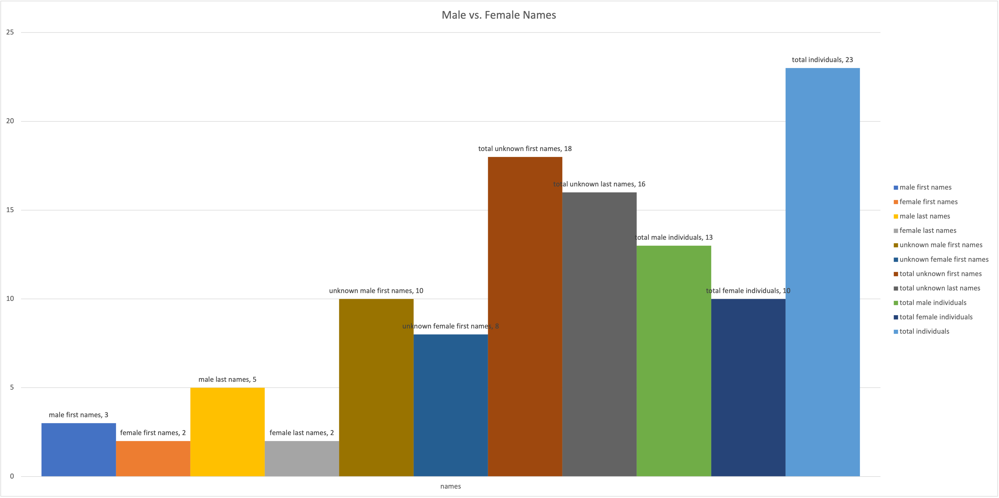
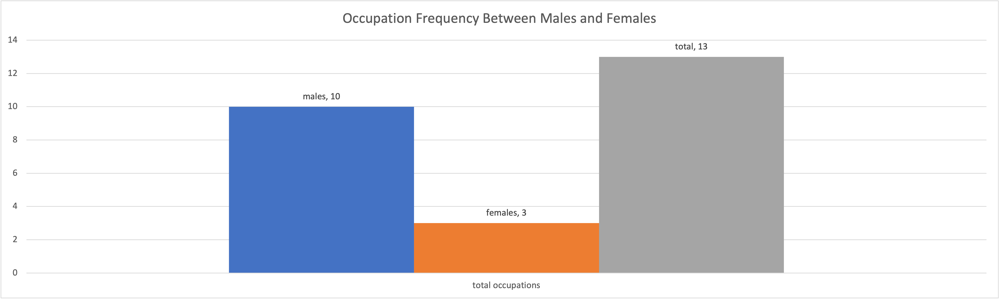
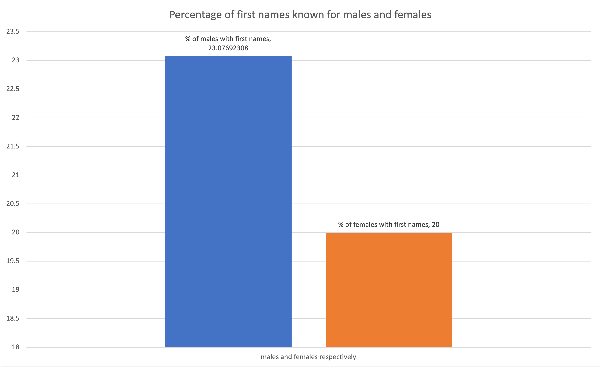

# Log Four
## Name: Iqbal Alibhai
### Date: 16/06/2022

#### Files
- Originally I downloaded the Old Bailey xml zip file.
- However, when I found the difficulties with manipulating the xml files, I decided to go back onto the website.
- I found that the website has a API that allows you to download specific cases based on search criteria.
- Through the API I found and downloaded ten xml files with cases on women defendants against male victims, with a guilty verdict, between 1675 to 1677.

- I then manually created a csv file that took the details I thought would show some sort of pattern and created a table.

#### Wget
- Attempted to download xcode as adviced in Part Two Revision.
```
xcode-select --install
```
- Stopped at finding software.
- Found a place that suggested I log into my apple account as a developer for the Mac I am working on currently and then download the necessary files.
- [Apple Developer](https://developer.apple.com/download/all/)
- Downloaded a version of xcode that was not compatible with my Mac operating system.
- Decided to look at more data to see if there was data that was more appropriate.
- I found from the tweets of Amalia Skarlatou Levi the archive of old bailey court cases.
- I initially attempted to find a way to webscrape the data.
- I found that I could download the files straight from the website.
- After downloading I found it was in xml format.

#### RScript
- I attempted to write a RScript that would convert the xml to csv.
- I came to find issues using RScript as it kept giving me the following screen.
(src:)</img>
- Errors such as:


#### Jupyter Notebook
- Found using python and actually coding to be easier and so I used Jupyter Notebook to convert xml to csv.
- Used [Stack Overflow](https://stackoverflow.com/questions/15921642/merging-xml-files-using-pythons-elementtree) to learn how to combine xml files together and convert them to csv.
- Found myself getting multiple errors including:


- Ended up speaking with my brother-in-law, an engineer who works with xml files, and found that the xml files are not set up for ease of manipulation.
- I realised that attempting to code a way to clean and table the xml files would take way longer than I had.

#### Excel
- Initially tried to convert xml to a table in excel however it did not come out properly.
- After manually creating the csv, I used Excel to make sure I had the correct number of commas and spaces.
- I was looking at filters and it saved after moving sections around.
- Had to go back into the csv file on Sublime and fix all the movements and additions.
- After fixing everything I created a copy of the `.csv` file just for Excel.
- Created the graphs for the website.
- Named and labeled the graphs.





#### OpenRefine
- Attempted to combine and convert the files using OpenRefine.
- The program had difficulty running with the amount of data.
- Could not facet the text, too much data.
- Coloumns are based on headers from xml file and not the key information.
- Python can more easily create the headers for important information.
- After creating the csv file: `femaleTrialsOldBailey.csv`, I used OpenRefine to cluster and to look for patterns.


#### Static Website
- Created a new folder called: `partFour` in the github.io repository.
- Created the `index.md` file and populated it with my findings and everything else.
- Imbedded the graph images from Excel.
- Set up a link on the main static page from which you can go to the part four page.

#### Possible Conclusions
- Not sure what conclusions can be made.
- One possible conclusion: looking at the fact that most of these women are unnamed, even though more of their male counterparts have at least a last name, suggests a certain level of bias or dismissiveness against women by the court during the late 1670s.
- Another possible conclusion: males have husband as a classified occupation however the females do not have wife as a classification. This could suggest something about the creators of the database.
- Of course this all based on a database of ten cases. 
